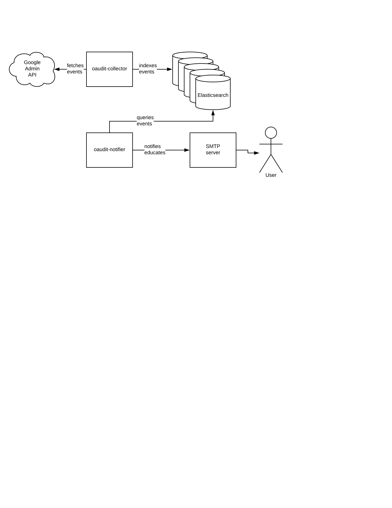

# oaudit

## Why

OAuth grants make it easier than ever to unintentionally give full access to employee and company data in the cloud to Phishermen/women, companies that data mine, and other undesirables.

This toolkit enables you to keep records about what access is shared and educate the users about the scopes that they grant an application. Currently the Google API does not allow our tooling to take an active role in deciding what access is granted.

## Features

- Writes all GSuite token events to Elasticsearch
- Notifies users upon authorizing untrusted or blacklisted apps
- Revokes access to blacklisted apps
- Educates end-users by visualizing risk rating of uncategorized apps using color-coded templates

## Components

### `oaudit-collector`

indexes authorization events from the Google Admin API into Elasticsearch.

### `oaudit-notifier`

sends notifications with educational information about Oauth scopes.

### Architecture diagram



## Getting started

### Prerequisites

#### Creating your Google project

1. Verify that you are a Google Admin or Superadmin with permission to access to the Admin Directory SDK API. Note: OAudit works with a standard admin account, you will not be able to revoke tokens that belong to other admins.

1. Follow [Google’s Python Quickstart Guide](https://developers.google.com/admin-sdk/directory/v1/quickstart/python) to create a project with the Admin SDK API enabled.

1. [Create a service account](https://console.cloud.google.com/projectselector/iam-admin/serviceaccounts) under your new project.

1. Save the service account secret file (default:client_secret.json).

### Standalone

#### starting oaudit-collector standalone

1. Install `oaudit-collector` requirements:

    ``` bash
    sudo pip3 install -r collector/requirements.txt
    ```

1. Place the service account secret in a safe location.

1. Run `oaudit-collector` with CLI args:

    ``` bash
    python3 collector/collector.py \
        --secret-file "/run/secrets/oauth-notify" \
        --service-account-email "svcaccount@domain.com" \
        --elasticsearch-hosts "esnode1:9200,esnode2:9200"
    ```

#### starting oaudit-notififer standalone

1. Install `oaudit-notifier` requirements:

    ``` bash
    sudo pip3 install -r notifier/requirements.txt
    ```

1. Run `oaudit-notifier` with CLI args:
